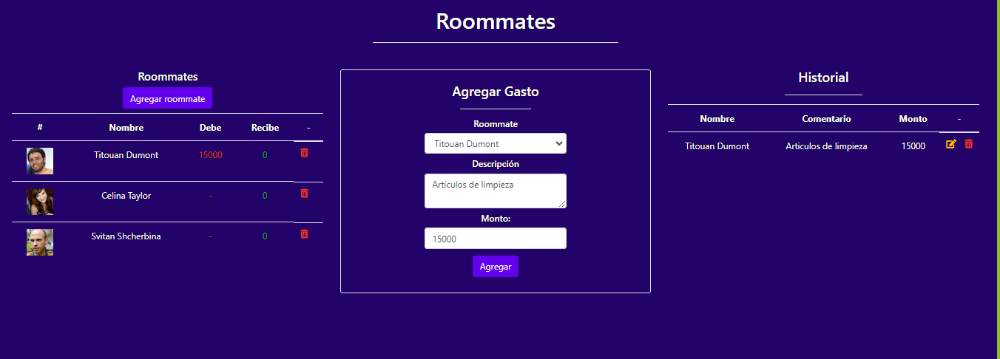

# Roommates Manager Api RandomUser

Este proyecto es una aplicación para gestionar gastos entre roommates. Permite agregar nuevos roommates, registrar gastos y actualizar los montos adeudados por cada uno, consumiendo los datos desde una API REST https://randomuser.me/api/ que retorna un usuario random.

## Descripción

La aplicación permite:

- Agregar nuevos roommates generados aleatoriamente.
- Registrar nuevos gastos para cada roommate.
- Actualizar y eliminar gastos existentes.
- Elimina roommates.
- Visualizar el historial de gastos.
- Calcular automáticamente los montos adeudados por cada roommate.

## Captura de Pantalla



## Instalación

1. Clona el repositorio.
   ```bash
   git clone https://github.com/Yistler/roommates-manager.git
   npm install -> dependencias 
   node server.js //correr el proyecto

## Dependencias
```
"dependencies": {
    "axios": "^1.7.2",
    "dotenv": "^16.4.5",
    "express": "^4.19.2",
    "uuid": "^10.0.0"
}